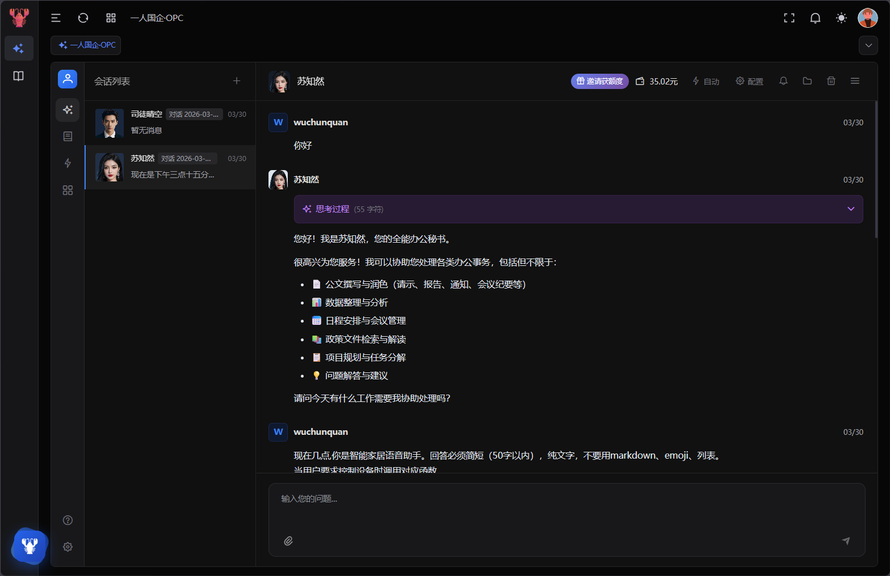

<p align="center">
  
</p>

<h1 align="center">一人国企·OPC</h1>

<p align="center">
  AI 员工平台 | 一人即公司
</p>

<p align="center">
  
  
  
  
  
</p>

<p align="center">
  
</p>

一个面向办公场景打造的 AI 员工平台。`OPC` 不是传统意义上的聊天机器人集合，而是一套可以真正落地到日常工作流里的智能办公操作系统：它把会话、工作区、文件系统、技能、知识库、工具调用和桌面能力整合到同一个平台里，让一个人也能像拥有一整个数字化团队一样工作。

它的目标不是“回答几个问题”，而是把 AI 从问答助手升级成可执行、可协作、可积累、可交付的生产力基础设施。无论是文档撰写、资料整理、代码处理、流程协作，还是为特定角色构建专属 AI 员工，`OPC` 都提供了一套完整的运行底座。

## 平台介绍

`OPC` 可以理解为一个面向组织和个人的 AI 工作操作平台：

- 它既能像本地桌面应用一样直接使用，也能像服务端系统一样部署到局域网或服务器。
- 它既能管理会话和知识库，也能真正操作文件、调用工具、执行命令、接管工作区。
- 它不是把大模型简单接进来，而是围绕“AI 员工”这个概念，构建了一整套角色、技能、审批、恢复、压缩和协作能力。

如果你想要的是一个真正能沉淀业务上下文、持续复用工作成果、并且可以二次开发的 AI 平台，这个项目就是为这种场景准备的。

## 一句话理解

`OPC` 是一个把“大模型能力、工作区能力、知识库能力、技能系统、工具系统、桌面能力”整合到一起的 AI 员工平台。它不是只提供一个对话框，而是试图让 AI 真正进入工作过程本身。

## 适用场景

- 个人超级个体：一个人管理多个长期任务、资料、项目和交付物
- 办公自动化：文档起草、内容整理、汇总分析、流程辅助
- 研发协作：代码工作区、文件读写、命令执行、知识沉淀
- 部门内应用：为不同岗位配置不同角色、技能和知识库
- 本地私有部署：希望在桌面、本地局域网或单机环境中运行 AI 平台

## 核心理念

- **不是聊天产品，而是工作平台**：会话只是入口，真正的价值在工作区、工具、知识和持续执行。
- **不是一次性回答，而是长期积累**：技能、知识库、上下文压缩、会话恢复都在为“长期可用”服务。
- **不是只能演示，而是可交付工程**：支持桌面、自用、服务端三种形态，适合继续做私有化和定制化。
- **不是单点 AI，而是可组合系统**：角色、会话、模型、技能、文件、目录、MCP、内部 API 都可以组合。

## 项目定位

- 本地可运行的 AI 员工平台
- 带独立会话工作区的文档 / 代码 / 知识协作界面
- 支持桌面、自用、服务端三种运行形态
- 可二次开发的 `Vue 3 + FastAPI + pywebview` 全栈项目

## 核心能力

- AI 会话与多会话管理
- 会话级工作区、文件树、内容编辑
- 额外挂载目录
- 技能系统（`SKILL.md`）
- 工具调用、确认模式、计划模式
- 上下文压缩与会话恢复
- 角色/人设、知识库、公开角色入口
- 基础后台：用户、权限、配置、文档
- 桌面运行与桌面打包

## 亮点能力

- **会话即工作空间**：每个会话都有自己的独立工作区，可以长期保留文件、过程和产出。
- **技能系统可落地**：通过 `SKILL.md` 组织专业能力，适合沉淀团队方法论和固定流程。
- **文件系统直连工作流**：AI 不只是回答问题，还能读写文件、搜索内容、处理目录和工作产物。
- **审批与计划模式**：在自动执行、人工确认、先规划后执行之间自由切换。
- **知识库不是外挂**：用户知识库、角色知识库、附加目录都能直接进入 AI 的工作语境。
- **桌面与服务端统一**：同一套代码可跑桌面客户端、自用单机模式、服务端模式。
- **适合二次开发**：后端是清晰的 FastAPI 模块结构，前端是标准 Vue 3 工程，容易改造。

## 为什么是 OPC

- 它不是孤立的聊天窗口，而是把 AI 接进真实工作区、真实文件系统、真实任务流。
- 它不是一次性对话工具，而是能长期保留上下文、技能和组织知识的工作平台。
- 它不是只能演示的 Agent，而是已经具备桌面化、本地化、服务化和交付能力的完整工程。
- 它适合个人超级个体，也适合小团队、业务部门、内部办公场景继续往上扩展。

## 架构概览

`OPC` 当前是一套前后端一体化工程：

- 前端负责会话界面、工作区交互、文件视图、设置页、角色和知识库管理
- 后端负责用户体系、权限体系、配置管理、Agent 会话、工作区和桌面启动逻辑
- Agent Runtime 负责具体执行，包括文件操作、命令执行、技能加载、审批、上下文恢复
- 桌面壳层负责把本地后端和 Web 前端组合成可直接交付的桌面应用

整体链路大致是：

`Vue 界面 -> FastAPI 接口 -> SessionManager / Claw Runtime -> 工作区 / 文件 / 技能 / 知识库 / 工具`

## 适合谁使用

- 想把 AI 从“问答工具”升级成“工作搭子”的个人开发者
- 需要本地化、私有化、可控运行环境的小团队
- 想基于现成工程继续做内部办公平台的二次开发者
- 需要一个 AI 工作台底座，而不是从零搭建整套架构的创业团队

## 平台截图

<p align="center">
  
</p>

## 技术栈

- 前端：Vue 3、Vite、Pinia、Vue Router、Element Plus
- 后端：FastAPI、SQLAlchemy、SQLite
- 桌面端：pywebview
- Agent Runtime：项目内置 `claw`
- 打包：PyInstaller

## 目录结构

```text
.
├─ src/                         前端源码
├─ pysrc/                       后端源码
│  ├─ desktop.py                pywebview 桌面入口
│  ├─ main.py                   FastAPI 入口
│  ├─ common/                   配置、路径、数据库、启动公共逻辑
│  ├─ modules/agent/            Agent 相关模块
│  ├─ claw/                     内置 Agent runtime
│  └─ static/                   默认配置、文档、静态资源
├─ build/
│  ├─ pywebview/scripts/        桌面打包脚本
│  ├─ pywebview/spec/           PyInstaller spec
│  ├─ pywebview/work/           PyInstaller 工作缓存
│  └─ pywebview/release/        桌面打包产物
├─ public/                      前端 public 资源
└─ README.md
```

## 环境要求

- Node.js `>= 20`
- pnpm `>= 8`
- Python `>= 3.11`
- 推荐使用 `uv`

## 快速开始

### 1. 安装前端依赖

```bash
pnpm install
```

### 2. 安装后端依赖

```bash
cd pysrc
uv venv
uv pip install -r requirements.txt
```

### 3. 启动后端

支持 3 套后端配置：

- `local`：桌面客户端本地后端，默认端口 `8766`
- `remote`：服务端模式，默认端口 `8005`
- `self_use`：自用模式本地后端，默认端口 `8005`

```bash
cd pysrc
python main.py local
python main.py remote
python main.py self_use
```

默认端口：

- 本地客户端配置：`8766`
- 服务端配置：`8005`

健康检查：

- `http://127.0.0.1:8766/health`
- `http://127.0.0.1:8005/health`

### 4. 启动前端开发环境

```bash
pnpm dev
```

默认前端开发地址：

- `http://127.0.0.1:3006`

### 5. 启动桌面端

先构建前端：

```bash
pnpm build
```

再按模式启动：

```bash
pnpm desktop:client
pnpm desktop:service
pnpm desktop:self-use
pnpm desktop:self-use:dev
```

含义：

- `desktop:client`
  - 桌面客户端模式
  - 使用 `pysrc/static/conf/local.ini`
  - 本地后端 `8766`
  - 可进入本地页面或远程 `desktop_entry_url`
- `desktop:service`
  - 服务端模式
  - 使用 `pysrc/static/conf/remote.ini`
  - 只启动后端，不打开 pywebview
- `desktop:self-use`
  - 自用模式
  - 使用 `pysrc/static/conf/self_use.ini`
  - 数据目录走 exe 同级 `static`
  - 自动登录预置账号
  - pywebview 直接进入本机服务地址
- `desktop:self-use:dev`
  - 自用模式开发联调
  - pywebview 直接进入本地 Vite 页面
  - 仍按 `self_use` 运行时规则处理 API、自动登录和界面裁剪

前端开发联调时，也可以让 pywebview 指向 Vite：

```bash
pnpm desktop:client:dev
```

## 运行模式

这个项目现在是“一套后端 + 一个桌面启动器”，可以跑三种模式。

### 1. 服务端模式

适合部署到服务器或局域网机器。

- `runtime_mode=service`
- 使用普通后端配置
- `local_agent=false`
- 数据、数据库、静态目录都放在可执行文件同级目录
- 默认端口 `8005`

### 2. 桌面客户端模式

适合单机桌面运行。

- `runtime_mode=desktop_client`
- `local_agent=true`
- 本地后端跑在 `8766`
- 数据目录走 appdir
- 页面可进入本地页面，也可以进入预配置的远程 `desktop_entry_url`

### 3. 自用模式

适合单机自用、本地部署给个人或单台机器。

- `runtime_mode=self_use`
- 启动 pywebview，但数据目录走 exe 同级 `static`
- 默认端口 `8005`
- 自动登录预置账号
- 本地页面和本地 API 使用同一地址
- 不使用 NewAPI 额度/邀请体系
- 隐藏云端 AI、本地/远程切换、额度和邀请码入口
- 保留桌面端能力，例如打开 Knowledge Base 和 Skills 当前目录

## 推荐启动方式

开发时通常只需要这 4 组命令：

```bash
pnpm dev
pnpm backend:service
pnpm backend:self-use
pnpm desktop:client:dev
pnpm desktop:self-use:dev
```

可以这样理解：

- 做纯前端页面开发：`pnpm dev`
- 调服务端模式接口：`pnpm backend:service`
- 调自用模式接口：`pnpm backend:self-use`
- 调桌面客户端壳子：`pnpm desktop:client:dev`
- 调自用模式桌面壳子：`pnpm desktop:self-use:dev`

生产/打包时再使用：

```bash
pnpm desktop:client
pnpm desktop:service
pnpm desktop:self-use
pnpm build:desktop
```

## 配置说明

### 后端配置文件

配置文件 section 为：

```ini
[系统配置]
```

常用配置项：

```ini
[系统配置]
name=一人国企·OPC
app_dir_name=一人国企·OPC
db=sqlite.db
port=8005
enable_agent=true
enable_tray=false
local_agent=false
desktop_entry_url=
runtime_mode=service
auto_login_username=admin
auto_login_password=admin123
```

字段说明：

- `name`
  - 产品显示名
- `app_dir_name`
  - 本地 appdir 目录名
- `db`
  - 数据库文件路径
- `port`
  - 后端端口
- `enable_agent`
  - 是否启用 Agent
- `enable_tray`
  - 当前项目已不再使用托盘，保留兼容字段
- `local_agent`
  - 兼容旧字段
  - 现在以 `runtime_mode` 为准，不建议再单独依赖它判断模式
- `desktop_entry_url`
  - 桌面客户端启动时进入的远程页面地址
- `runtime_mode`
  - `service` / `desktop_client` / `self_use`
- `auto_login_username`
  - 自用模式自动登录用户名
- `auto_login_password`
  - 自用模式自动登录密码

### 默认配置文件

- `pysrc/static/conf/local.ini`
- `pysrc/static/conf/remote.ini`
- `pysrc/static/conf/default.ini`
- `pysrc/static/conf/self_use.ini`

### 三种典型配置

服务端模式：

```ini
[系统配置]
runtime_mode=service
name=一人国企·OPC
app_dir_name=一人国企·OPC
db=sqlite.db
port=8005
local_agent=false
desktop_entry_url=
```

桌面客户端模式：

```ini
[系统配置]
runtime_mode=desktop_client
name=一人国企·OPC
app_dir_name=一人国企·OPC
db=static/sqlite.db
port=8766
local_agent=true
desktop_entry_url=https://your-server.example.com
```

自用模式：

```ini
[系统配置]
runtime_mode=self_use
name=一人国企·OPC
app_dir_name=一人国企·OPC
db=static/sqlite.db
port=8005
local_agent=false
desktop_entry_url=
auto_login_username=admin
auto_login_password=admin123
```

### 启动时配置选择

```bash
cd pysrc
python main.py local
python main.py remote
python main.py self_use
python main.py D:\\path\\to\\config.ini
```

桌面端也支持读取外部 `config.ini`：

- 如果可执行文件同级有 `config.ini`，会优先使用它
- 没有时才回退到内置默认配置
- 也可以直接传 `local` / `remote` / `self_use`
- `runtime_mode` 是当前的主判断字段
- `desktop_client` 走 appdir
- `service` 和 `self_use` 走 exe 同级目录

## 产品改名

项目已经整理成“显示名”和“目录名”可分离。

### 后端/桌面运行时改名

改 `config.ini`：

```ini
[系统配置]
name=你的新产品名
app_dir_name=你的新目录名
```

### 前端改名

改根目录 `.env`：

```bash
VITE_APP_NAME=你的新产品名
VITE_APP_DIR_NAME=你的新目录名
```

然后重新构建前端：

```bash
pnpm build
```

## 本地数据目录

### 桌面客户端模式

`local_agent=true` 时，数据目录在 appdir：

- Windows: `%APPDATA%/{app_dir_name}`
- macOS: `~/Library/Application Support/{app_dir_name}`
- Linux: `~/.local/share/{app_dir_name}`

### 服务端模式

打包后服务端模式下，数据目录在可执行文件同级：

- `./static`
- `./sqlite.db` 或配置指定的数据库路径

## 前端环境变量

常用项在根目录 `.env*`：

```bash
VITE_ENABLE_AGENT=true
VITE_LOCAL_API_BASE_URL=http://127.0.0.1:8766
VITE_APP_NAME=一人国企·OPC
VITE_APP_DIR_NAME=一人国企·OPC
```

其他环境文件：

- `.env`
- `.env.development`
- `.env.production`

## 打包

### 构建前端静态资源

```bash
pnpm build
```

前端构建产物输出到：

- `pysrc/static/dist`

### pywebview 桌面打包

推荐直接用仓库脚本：

```bash
pnpm build:desktop
```

它会先执行前端构建，再自动按当前系统选择打包脚本。

也可以分开用：

- 只执行当前系统桌面打包：`pnpm build:desktop:only`
- 强制 Windows 打包：`pnpm build:desktop:win`
- 强制 macOS 打包：`pnpm build:desktop:mac`

Windows：

```bat
build\pywebview\scripts\build-win.bat
```

macOS：

```bash
chmod +x build/pywebview/scripts/build-mac.sh
./build/pywebview/scripts/build-mac.sh
```

相关目录：

- 打包脚本：`build/pywebview/scripts`
- spec：`build/pywebview/spec`
- 工作缓存：`build/pywebview/work`
- 打包产物：`build/pywebview/release`

### 当前桌面入口

- `pysrc/desktop.py`
- Windows 图标优先读取：
  - `pysrc/res/icon.ico`
  - 没有时回退 `pysrc/res/logo.ico`
  - 再没有时回退 `public/favicon.ico`

## 常见问题

### 1. 桌面端白屏

先确认：

- 已执行 `pnpm build`
- `pysrc/static/dist` 存在
- 或开发模式下使用 `pnpm desktop:pywebview:dev`
 - 或开发模式下使用 `pnpm desktop:client:dev`

### 2. 打包后静态资源找不到

桌面模式会把打包内资源释放到目标目录：

- 客户端模式：释放到 appdir
- 服务端模式：释放到 exe 同级 `static`

### 3. 桌面端打开的是服务端页面还是本地页面

由这几个值决定：

- `runtime_mode`
- `desktop_entry_url`
- 启动时外部 `config.ini`

### 4. 打包后没有任何输出

当前桌面入口会写日志，优先看启动日志和 `health` 端点是否正常。

## Agent 能力范围

当前开源版本主要围绕“会话工作区”展开：

- 会话独立工作区
- 额外挂载目录
- 文件读写、搜索、编辑
- 命令执行
- 技能加载
- 上下文压缩与恢复
- 工具审批与计划审批

适合做：

- 本地办公助手
- 文档整理助手
- 代码协作助手
- 内部知识库问答助手
- 桌面端 AI 工作台

## 开源说明

这个仓库更适合作为“可运行的项目骨架”和“二次开发基础工程”，不是完全产品化的 SaaS 成品。

当前开源版本优先保留了：

- AI 会话主链路
- 工作区与文件系统
- 技能系统
- 审批模式
- pywebview 桌面能力
- 基础后台模块

部分渠道化、内部化能力默认隐藏、关闭或未作为主要入口暴露。

## License

本项目使用 [GNU AGPL v3.0](./LICENSE)，许可证标识为 `AGPL-3.0-only`。

## 微信交流群

如果你想交流使用方式、二次开发、部署经验或产品共建，可以扫码加入微信交流群：

<p align="center">
  
</p>
